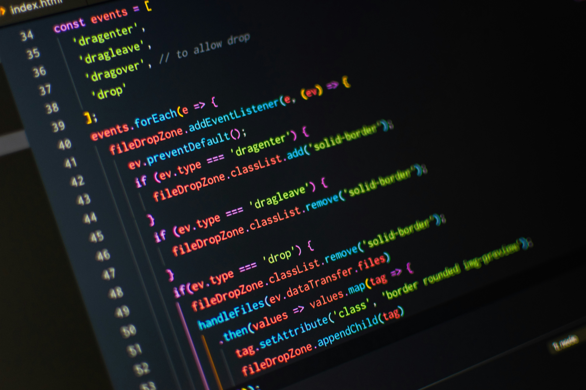

# DevOps13 Website

This is the official website for DevOps13, a community dedicated to sharing knowledge and resources about DevOps practices. The website provides information about upcoming events, workshops, and resources for learning about DevOps.



## Features
- HTML
- Header
- Paragraph

### How to work with website

1. Clone repo
```
git clone git@github.com:kadimasum/my-first-web.git

```
2. Change directory to the project directory
```
cd my-first-web
```
3. Open index.html on your browser